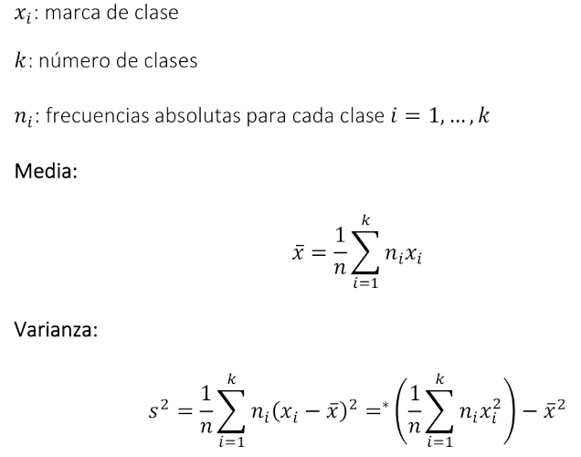
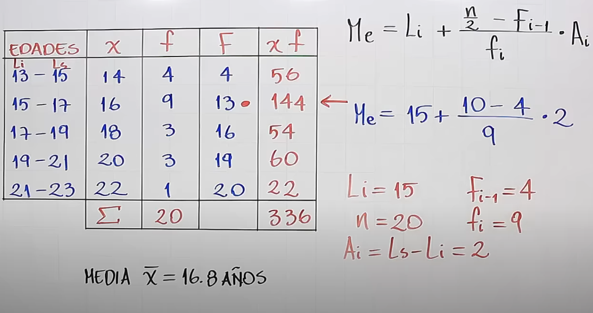

# Datos Agrupados

[Regresar](../../README.md)

## Ejemplo 1

Edades de estudiantes

| X  | f  | F  | X*f |
|----|----|----|-----|
| 13 | 3  | 3  | 39  |
| 14 | 14 | 17 | 196 |
| 15 | 23 | 40 | 345 |
| 16 | 10 | 50 | 160 |
| 17 | 5  | 55 | 85  |
| 18 | 4  | 59 | 72  |
| 19 | 1  | 60 | 19  |

- Media = Sum(X*f) / N = 916 / 60

- Mediana
    - Posición: n / 2 = 60 / 2 = 30
    - Buscamos el 30 en F
    - Si no hallamos el 30 buscamos el que le sigue o sea el 40
    - Entonces la mediana seria el número 15 porque es la X que contiene 40

- Moda es el dato que mas se repite: en este caso la x con f mayor seria 15
  porque f es 23

## Ejemplo 2

Edades de estudiantes

| Edades  | X   | f | F  |
|---------|-----|---|----|
| 13 - 15 | 14  | 4 | 4  |
| 15 - 17 | 16  | 9 | 13 |
| 17 - 19 | 18  | 3 | 16 |
| 19 - 21 | 20  | 3 | 19 |
| 21 - 23 | 22  | 1 | 20 |

- X es la marca de clase que resulta del promedio de edades
- Promedio = (14*4 + 16*9 + 18*3 + 20*3 + 22*1) / 20 = 336 / 20 = 16.8
- Mediana
  - 

  - Posición
    - Si el número de datos es par se calcula n/2
    - Si el número de datos es impar se calcula (n+1)/2

  - Si por decir algo la posición nos da 16, y este número se encuentra en la F
    entonces tomamos el límite superior del intervalo como mediana (19).

## Ejemplo 3

Se ha solicitado a 50 personas contestar cuantas horas duermen diariamente y
se realizó la siguiente tabla:

| Cantidad de horas | Cantidad de personas (FA) |
|-------------------|---------------------------|
| 6                 | 3                         |
| 7                 | 16                        |
| 8                 | 20                        |
| 9                 | 10                        |
| 10                | 1                         |

- La variable aleatoria es: Cantidad de horas
- La Frecuencia Absoluta es: Cantidad de personas para cada una de las clases
  de horas

| X  | FA |
|----|----|
| 6  | 3  |
| 7  | 16 |
| 8  | 20 |
| 9  | 10 |
| 10 | 1  |

| X  | FA | FAA |
|----|----|-----|
| 6  | 3  | 3   |
| 7  | 16 | 19  |
| 8  | 20 | 39  |
| 9  | 10 | 49  |
| 10 | 1  | 50  |
