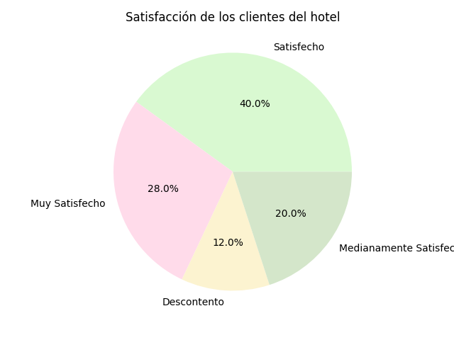

# Estadística Descriptiva

[Regresar](../../README.md)

Describe una variable aleatoria:

- Resume
- Analiza
- Saca conclusiones

Se agrupa en tres estudios fundamentales:

- Tablas de frecuencias
- Gráficos
- Resúmenes numéricos

## Tablas de frecuencias

Tenemos una muestra de 25 datos de una variable aleatoria que es el grado de
satisfacción de los clientes de un hotel.

- Satisfecho
- Muy Satisfecho
- Descontento
- Medianamente Satisfecho
- Satisfecho
- Satisfecho
- Medianamente Satisfecho
- Satisfecho
- Muy Satisfecho
- Muy Satisfecho
- Muy Satisfecho
- Descontento
- Descontento
- Medianamente Satisfecho
- Satisfecho
- Satisfecho
- Satisfecho
- Muy Satisfecho
- Satisfecho
- Muy Satisfecho
- Muy Satisfecho
- Medianamente Satisfecho
- Satisfecho
- Medianamente Satisfecho
- Satisfecho

| Clase                   | Frecuencia Absoluta | Frecuencia Absoluta Acumulada | Frecuencia Relativa | Frecuencia Relativa Acumulada |
|-------------------------|---------------------|-------------------------------|---------------------|-------------------------------|
| Muy Satisfecho          | 7                   | 7                             | 7/25                | 7/25                          |
| Satisfecho              | 10                  | 10                            | 10/25               | 17/25                         |
| Medianamente Satisfecho | 5                   | 22                            | 5/25                | 22/25                         |
| Descontento             | 3                   | 25                            | 3/25                | 25/25                         |

Características de una tabla de frecuencias:

- La suma de los valores de la columna `Frecuencia Absoluta` es igual al número
  de elementos de la muestra.

- El primer elemento de la columna `Frecuencia Absoluta Acumulada` es igual
  al primer elemento de la columna `Frecuencia Absoluta`.

- El último elemento de la columna `Frecuencia Absoluta Acumulada` es igual
  al número de elementos de la muestra.

- La suma de elementos de la columna `Frecuencia Relativa` es igual a 1.

- El último elemento de la columna `Frecuencia Relativa Acumulada` es 1.

## Gráficos

### Pie Chart

