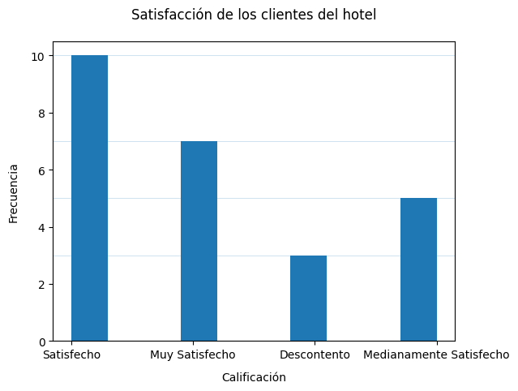
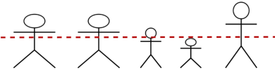
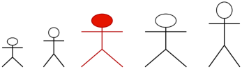
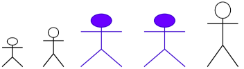
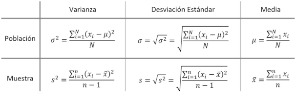

# Estadística Descriptiva

[Regresar](../../README.md)

La estadística descriptiva, describe una variable aleatoria.

## Variables aleatorias

- Resume
- Analiza
- Saca conclusiones

Se agrupa en tres estudios fundamentales:

- Tablas de frecuencias
- Gráficos
- Resúmenes numéricos

## Tablas de frecuencias

Tenemos una muestra de 25 datos de una variable aleatoria que es el grado de
satisfacción de los clientes de un hotel.

- Satisfecho
- Muy Satisfecho
- Descontento
- Medianamente Satisfecho
- Satisfecho
- Satisfecho
- Medianamente Satisfecho
- Satisfecho
- Muy Satisfecho
- Muy Satisfecho
- Muy Satisfecho
- Descontento
- Descontento
- Medianamente Satisfecho
- Satisfecho
- Satisfecho
- Satisfecho
- Muy Satisfecho
- Satisfecho
- Muy Satisfecho
- Muy Satisfecho
- Medianamente Satisfecho
- Satisfecho
- Medianamente Satisfecho
- Satisfecho

| Clase                   | Frecuencia Absoluta | Frecuencia Absoluta Acumulada | Frecuencia Relativa | Frecuencia Relativa Acumulada |
|-------------------------|---------------------|-------------------------------|---------------------|-------------------------------|
| Muy Satisfecho          | 7                   | 7                             | 7/25                | 7/25                          |
| Satisfecho              | 10                  | 10                            | 10/25               | 17/25                         |
| Medianamente Satisfecho | 5                   | 22                            | 5/25                | 22/25                         |
| Descontento             | 3                   | 25                            | 3/25                | 25/25                         |

Características de una tabla de frecuencias:

- La suma de los valores de la columna `Frecuencia Absoluta` es igual al número
  de elementos de la muestra.

- El primer elemento de la columna `Frecuencia Absoluta Acumulada` es igual
  al primer elemento de la columna `Frecuencia Absoluta`.

- El último elemento de la columna `Frecuencia Absoluta Acumulada` es igual
  al número de elementos de la muestra.

- La suma de elementos de la columna `Frecuencia Relativa` es igual a 1.

- El último elemento de la columna `Frecuencia Relativa Acumulada` es 1.

## Gráficos

### Pie Chart

### Histograma

## Resúmenes numéricos

### Medidas de centralización (tendencia central)

Ver donde se encuentra el centro de los datos.

#### Media (Mean, Media aritmética)

Es el valor obtenido al sumar todos los datos y dividir el resultado entre el
número total de datos.

##### Ejemplo Edades de estudiantes

15, 16, 14, 17, 15

Promedio = (15+16+14+17+15) / 5 = 77 / 5 = 15.4

El promedio de edades es 15.4 lo cual se podría aproximar a 15 años pues podría
ser inválido 15.4 años en cierto contexto.

#### Mediana (Median)

Es el valor que ocupa el lugar central de todos los datos cuando están
ordenados.

#### Moda (Mode)

El o lo valores que mas se repiten.

##### Ejemplos

- 15, 14, 16, 15, 15, 17: Mo = 15
- 12, 13, 13, 14, 15, 15, 16: Mo = 13, 15 Distribución Bimodal
- 12, 13, 13, 14, 14, 15, 15, 16: Mo = 13, 14, 15 Distribución Multimodal

### Medidas de dispersión

Ver si los datos se encuentran concentrados o alejados de las medidas de
centralización.

#### Varianza y desviación típica (desviación estándar)

- Cuán alejados están los datos de la media.
- Promedio de los cuadrados de las desviaciones medidas alrededor de la media.

[Referencia](https://matemovil.com/wp-content/uploads/2019/10/f%C3%B3rmulas-de-la-varianza-y-la-desviaci%C3%B3n-est%C3%A1ndar.jpg)

La desviación típica, también conocida como desviación estándar, es una medida
cuantitativa de dispersión que indica cuánto varían los datos en un conjunto
respecto a su media.

Un valor alto indica que los datos están muy dispersos respecto a la media,
mientras que un valor bajo indica que están más concentrados cerca de la media.

La desviación típica ayuda a identificar valores atípicos o outliers.
Generalmente, si un valor está a más de 2 o 3 desviaciones típicas de la media,
puede considerarse un valor atípico.

#### Desviación media

Es la diferencia en valor absoluto entre cada valor de la variable y la
media aritmética.

##### Ejemplo

Edades: 12, 13, 12, 14, 15

Promedio = 12+13+12+14+15 / 5 = 66 / 5 = 13.2

Desviación de cada edad respecto a la media.

- 12: |12-13.2| = |-1.2| = 1.2
- 13: |13-13.2| = |-0.2| = 0.2
- 12: |12-13.2| = |-1.2| = 1.2
- 14: |14-13.2| = |-0.8| = 0.8
- 15: |15-13.2| = |-1.8| = 1.8

Dmedia = 1.2+0.2+1.2+0.8+1.8 / 5 = 5.2 / 5 = 1.04
