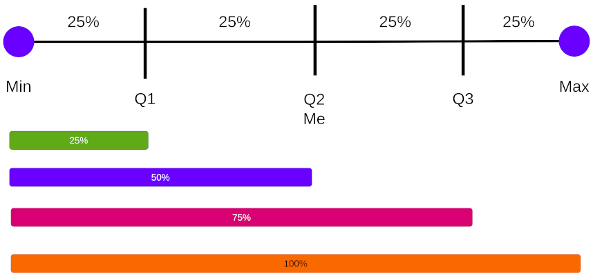

# Medidas de posición

[Regresar](../../README.md)

Las medidas de posición relativa se llaman cuantiles y se dividen en tres
grandes grupos:

- Cuartiles: 25%, 50%, 75%
- Quintiles: 20%, 40%, 60%, 80%
- Deciles: 10%, 20%, 30%, 40%, 50%, 60%, 70%, 80%, 90%
- Percentiles: 1%, 2%, 3%, 4%, 5%, 6%, 7%, 8%, ..., 99%

Dividen una distribución ordenada en partes iguales.

Para calcular medidas de posición es necesario que los datos estén ordenados
de menor a mayor.

## Cuartiles

