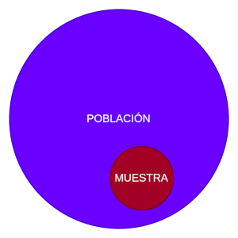
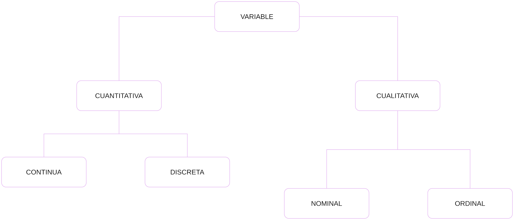
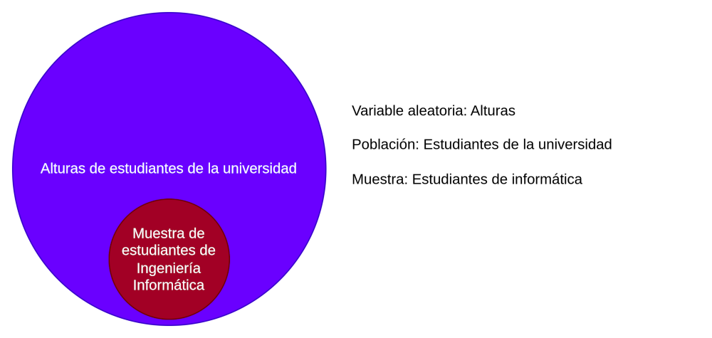

# Muestra

[Regresar](../../README.md)

Una **muestra** ó **sample** es un subconjunto de datos de una población.

Una **población** es un conjunto de **elementos/objetos/individuos** sobre la
cual se va a estudiar una **característica**.

Un **elemento/objeto/individuo** o **unidad estadística**, es cada uno de los
miembros que componen la **población**.

Una **muestra** es entonces el grupo de **elementos/objetos/individuos** a
quienes se les `pregunta`.

**Dato** es cada uno de los valores obtenidos (las respuestas que nos dan).

En nuestros estudios nos interesa obtener una **Muestra Aleatoria Simple**
(MAS) que tiene como característica principal es que es **representativa**.

MAS es uno de los tipos de muestreo y consiste en dar a todos los elementos de
la población la misma probabilidad de ser elegidos.

## Variables

- Cualitativas: características que no pueden ser medidas con números
  - Nominal: no admite un orden
    - Estado civil
    - Color preferido
  - Ordinal: existe un orden
    - Grado escolar
- Cuantitativa: se pueden expresar mediante un número
  - Discreta (contable)
    - Asistentes a un estadio
  - Continua
    - Altura de las personas

## ¿Qué es una variable aleatoria?

- Es una característica de la población.
- Sigue un determinado comportamiento llamado "Distribución".

Hay 2 tipos de variables aleatorias:

- Discretas
    - Contable ó Enumerable
        - Ciudades
        - Cantidad de personas
- Contínuas
    - Puede tomar un número infinito de valores dentro de un cierto intervalo
        - Peso
        - Altura

**Ejemplo 1:** Variable aleatoria contínua

[Ejemplos](./ejemplos.md)
